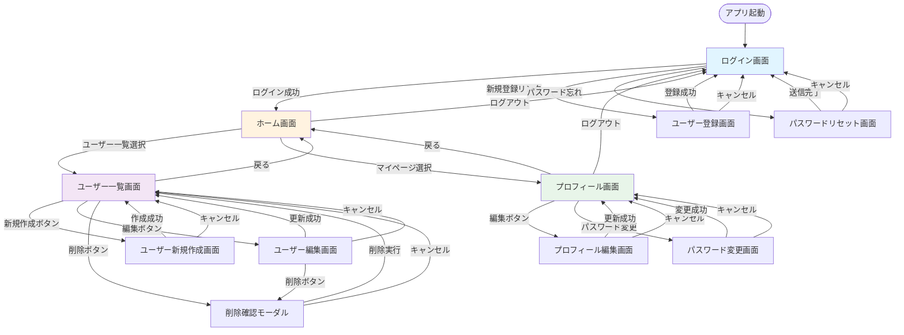

# 画面遷移図

## プロジェクト: ユーザー管理システム
**作成日**: 2025-11-15
**バージョン**: 1.0

---

## Mermaid形式の画面遷移図

---

## 画面遷移一覧表

| No | 遷移元画面 | イベント | 遷移先画面 | 遷移条件 | 備考 |
|----|-----------|---------|-----------|---------|------|
| 1 | アプリ起動 | - | ログイン画面 | - | アプリ起動時の初期画面 |
| 2 | ログイン画面 | ログインボタン押下 | ホーム画面 | 認証成功 | Token発行・セッション確立 |
| 3 | ログイン画面 | 新規登録リンク | ユーザー登録画面 | - | - |
| 4 | ログイン画面 | パスワード忘れリンク | パスワードリセット画面 | - | - |
| 5 | ユーザー登録画面 | 登録ボタン押下 | ログイン画面 | 登録成功 | 登録完了メッセージ表示 |
| 6 | ユーザー登録画面 | キャンセルボタン押下 | ログイン画面 | - | 入力内容破棄 |
| 7 | パスワードリセット画面 | 送信ボタン押下 | ログイン画面 | メール送信成功 | 完了メッセージ表示 |
| 8 | パスワードリセット画面 | キャンセルボタン押下 | ログイン画面 | - | - |
| 9 | ホーム画面 | ユーザー一覧メニュー | ユーザー一覧画面 | - | - |
| 10 | ホーム画面 | マイページメニュー | プロフィール画面 | - | - |
| 11 | ホーム画面 | ログアウトボタン押下 | ログイン画面 | - | セッション破棄 |
| 12 | ユーザー一覧画面 | 新規作成ボタン押下 | ユーザー新規作成画面 | 権限あり | 管理者権限必要 |
| 13 | ユーザー一覧画面 | 編集ボタン押下 | ユーザー編集画面 | 権限あり | 管理者権限必要 |
| 14 | ユーザー一覧画面 | 削除ボタン押下 | 削除確認モーダル | 権限あり | 管理者権限必要 |
| 15 | ユーザー一覧画面 | 戻るボタン押下 | ホーム画面 | - | - |
| 16 | ユーザー新規作成画面 | 作成ボタン押下 | ユーザー一覧画面 | 作成成功 | 成功メッセージ表示 |
| 17 | ユーザー新規作成画面 | キャンセルボタン押下 | ユーザー一覧画面 | - | 入力内容破棄確認 |
| 18 | ユーザー編集画面 | 更新ボタン押下 | ユーザー一覧画面 | 更新成功 | 成功メッセージ表示 |
| 19 | ユーザー編集画面 | 削除ボタン押下 | 削除確認モーダル | 権限あり | - |
| 20 | ユーザー編集画面 | キャンセルボタン押下 | ユーザー一覧画面 | - | 変更内容破棄確認 |
| 21 | 削除確認モーダル | 削除ボタン押下 | ユーザー一覧画面 | 削除成功 | 成功メッセージ表示 |
| 22 | 削除確認モーダル | キャンセルボタン押下 | 元の画面 | - | モーダル閉じる |
| 23 | プロフィール画面 | 編集ボタン押下 | プロフィール編集画面 | - | - |
| 24 | プロフィール画面 | パスワード変更ボタン押下 | パスワード変更画面 | - | - |
| 25 | プロフィール画面 | ログアウトボタン押下 | ログイン画面 | - | セッション破棄 |
| 26 | プロフィール画面 | 戻るボタン押下 | ホーム画面 | - | - |
| 27 | プロフィール編集画面 | 更新ボタン押下 | プロフィール画面 | 更新成功 | 成功メッセージ表示 |
| 28 | プロフィール編集画面 | キャンセルボタン押下 | プロフィール画面 | - | 変更内容破棄確認 |
| 29 | パスワード変更画面 | 変更ボタン押下 | プロフィール画面 | 変更成功 | 成功メッセージ表示 |
| 30 | パスワード変更画面 | キャンセルボタン押下 | プロフィール画面 | - | - |

---

## 認証状態による遷移制御

### 未認証時にアクセス可能な画面
- ログイン画面
- ユーザー登録画面
- パスワードリセット画面

### 認証済み時にアクセス可能な画面
- ホーム画面
- ユーザー一覧画面（閲覧）
- プロフィール画面
- プロフィール編集画面
- パスワード変更画面

### 管理者権限が必要な画面
- ユーザー新規作成画面
- ユーザー編集画面
- ユーザー削除機能

---

## エラー時の遷移

| エラー種別 | 遷移先 | 備考 |
|-----------|-------|------|
| 認証エラー（401） | ログイン画面 | セッション破棄、エラーメッセージ表示 |
| 権限エラー（403） | 元の画面 | エラートースト表示 |
| データ不在（404） | 一覧画面 | エラートースト表示 |
| サーバーエラー（500） | 元の画面 | エラートースト表示、リトライ可能 |
| ネットワークエラー | 元の画面 | エラートースト表示、リトライ促進 |

---

## 変更履歴

| バージョン | 日付 | 変更者 | 変更内容 |
|------------|------|--------|----------|
| 1.0 | 2025-11-15 | 設計チーム | 初版作成 |
