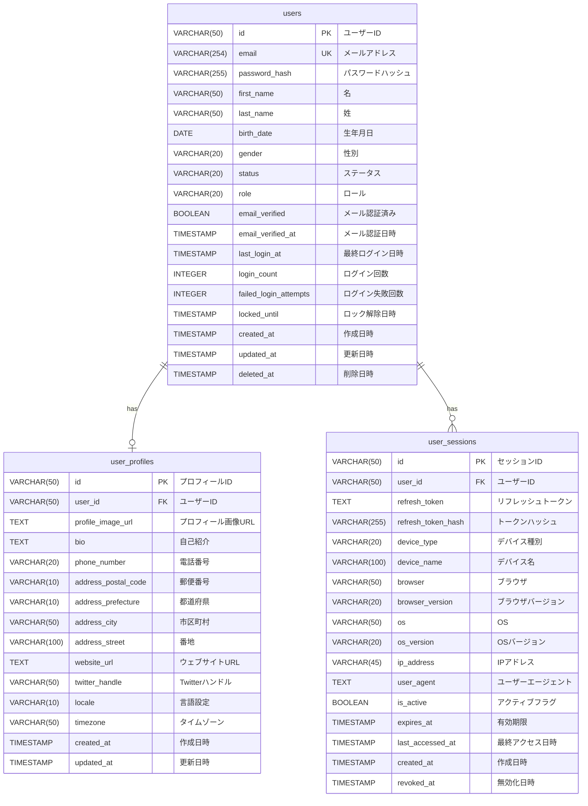
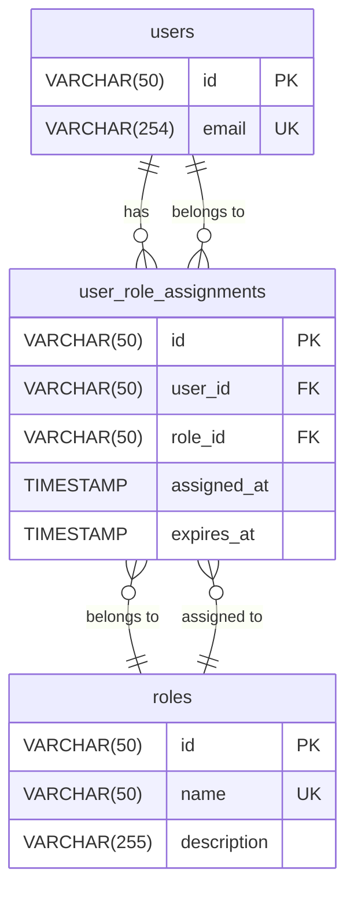
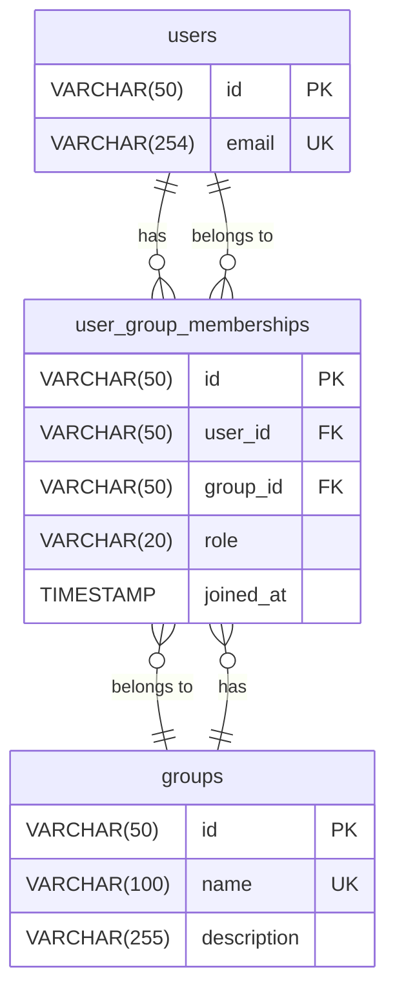

# ER図（Entity Relationship Diagram）

## プロジェクト: ユーザー管理システム
**作成日**: 2025-11-15
**バージョン**: 1.0

---

## Mermaid形式のER図



---

## リレーションシップ詳細

### 1. users → user_profiles（1対1）

#### リレーション種別
- **カーディナリティ**: 1対0..1（1ユーザーに対して0または1プロフィール）
- **親テーブル**: users
- **子テーブル**: user_profiles
- **外部キー**: user_profiles.user_id → users.id

#### 制約
```sql
CONSTRAINT fk_user_profiles_user_id
    FOREIGN KEY (user_id)
    REFERENCES users(id)
    ON DELETE CASCADE
    ON UPDATE CASCADE
```

#### 説明
- 1人のユーザーは必ず1つのプロフィールを持つ
- ユーザー削除時にプロフィールも同時に削除される（CASCADE）
- プロフィールはユーザー登録時に自動作成される

---

### 2. users → user_sessions（1対多）

#### リレーション種別
- **カーディナリティ**: 1対0..*（1ユーザーに対して0個以上のセッション）
- **親テーブル**: users
- **子テーブル**: user_sessions
- **外部キー**: user_sessions.user_id → users.id

#### 制約
```sql
CONSTRAINT fk_user_sessions_user_id
    FOREIGN KEY (user_id)
    REFERENCES users(id)
    ON DELETE CASCADE
    ON UPDATE CASCADE
```

#### 説明
- 1人のユーザーは複数のデバイス・ブラウザでログイン可能
- 各ログインセッションごとに1レコード作成
- 最大5セッション（アプリケーション側で制御）
- ユーザー削除時にすべてのセッションも削除される（CASCADE）

---

## テーブルごとのリレーション一覧

### users（ユーザー）
| リレーション | 相手テーブル | 種別 | FK | 備考 |
|------------|------------|------|-----|------|
| has one | user_profiles | 1対1 | user_profiles.user_id | ユーザーはプロフィールを持つ |
| has many | user_sessions | 1対多 | user_sessions.user_id | ユーザーは複数のセッションを持つ |

### user_profiles（ユーザープロフィール）
| リレーション | 相手テーブル | 種別 | FK | 備考 |
|------------|------------|------|-----|------|
| belongs to | users | 1対1 | user_id | プロフィールは1人のユーザーに属する |

### user_sessions（ユーザーセッション）
| リレーション | 相手テーブル | 種別 | FK | 備考 |
|------------|------------|------|-----|------|
| belongs to | users | 多対1 | user_id | セッションは1人のユーザーに属する |

---

## 拡張可能なテーブル設計（将来の実装候補）

### 多対多リレーションの例

以下は将来の機能拡張時に追加する可能性のあるテーブル例です：

#### 4. user_roles（ユーザーロール）- 多対多


**説明**:
- 1人のユーザーが複数のロールを持てる
- 1つのロールが複数のユーザーに割り当てられる
- 中間テーブル（user_role_assignments）で多対多を実現

---

#### 5. user_groups（ユーザーグループ）- 多対多


**説明**:
- 1人のユーザーが複数のグループに所属できる
- 1つのグループに複数のユーザーが所属できる
- グループ内での役割（owner/admin/member）も管理

---

## インデックス戦略

### PRIMARY KEYインデックス
- すべてのテーブルのidカラムに自動作成
- クラスター化インデックス（PostgreSQL）

### FOREIGN KEYインデックス
```sql
-- user_profiles
CREATE UNIQUE INDEX idx_user_profiles_user_id ON user_profiles(user_id);

-- user_sessions
CREATE INDEX idx_user_sessions_user_id ON user_sessions(user_id);
```

### 検索用インデックス
```sql
-- users
CREATE UNIQUE INDEX idx_users_email ON users(email);
CREATE INDEX idx_users_status ON users(status);
CREATE INDEX idx_users_created_at ON users(created_at);

-- user_sessions
CREATE INDEX idx_user_sessions_refresh_token_hash ON user_sessions(refresh_token_hash);
CREATE INDEX idx_user_sessions_expires_at ON user_sessions(expires_at);
CREATE INDEX idx_user_sessions_is_active ON user_sessions(is_active);
```

---

## データ整合性制約

### 参照整合性
- すべての外部キーにFOREIGN KEY制約を設定
- ON DELETE CASCADEで親レコード削除時に子レコードも削除
- ON UPDATE CASCADEで親レコード更新時に子レコードも更新

### 一意性制約
- users.email: メールアドレスの重複を防ぐ
- user_profiles.user_id: 1ユーザーに1プロフィールを保証

### CHECK制約
- users.status: 'active' または 'inactive'のみ許可
- users.role: 'user' または 'admin'のみ許可
- users.gender: 定義された値のみ許可

---

## 正規化レベル

### 第3正規形（3NF）を採用
- **第1正規形**: すべての列がアトミック（分割不可能）
- **第2正規形**: 部分関数従属を排除（主キーの一部に依存しない）
- **第3正規形**: 推移的関数従属を排除（非主キー列が他の非主キー列に依存しない）

### 正規化による利点
1. データの冗長性を最小化
2. 更新異常の防止
3. 削除異常の防止
4. 挿入異常の防止

### 非正規化の考慮
パフォーマンス要件によっては以下を検討：
- 頻繁にJOINするカラムの非正規化
- 集計値のキャッシュテーブル作成
- マテリアライズドビューの活用

---

## draw.io用XML（別途作成可能）

draw.ioで編集可能なER図は別途XMLファイルとして保存することも可能です。
上記のMermaid図をベースに、以下のツールでdraw.io形式に変換できます：

1. Mermaid Live Editor（https://mermaid.live/）でSVGエクスポート
2. draw.ioでSVGインポート
3. 手動で調整・装飾

---

## 変更履歴

| バージョン | 日付 | 変更者 | 変更内容 |
|------------|------|--------|----------|
| 1.0 | 2025-11-15 | 設計チーム | 初版作成 |
