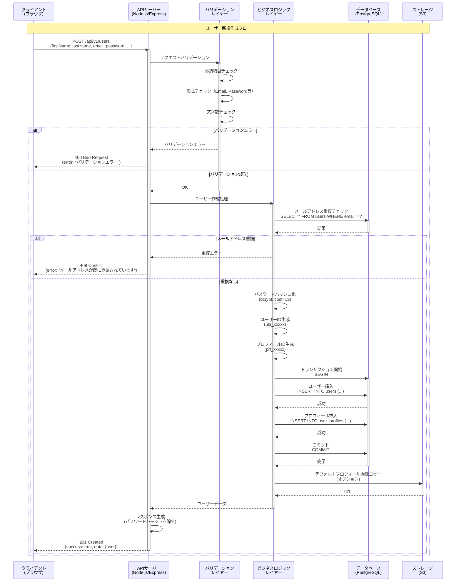
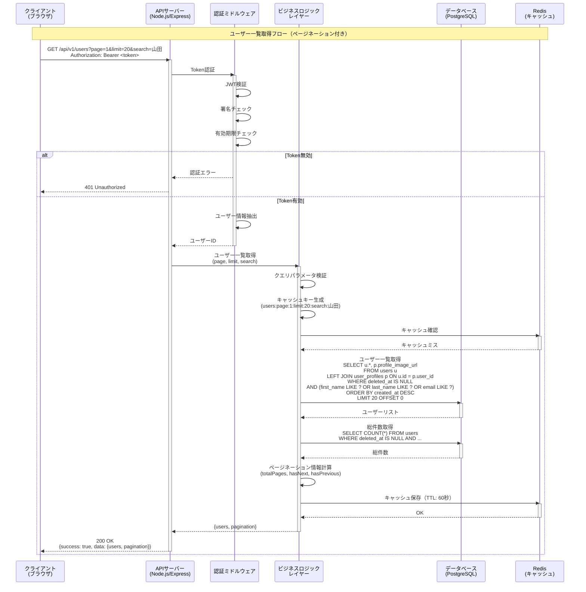
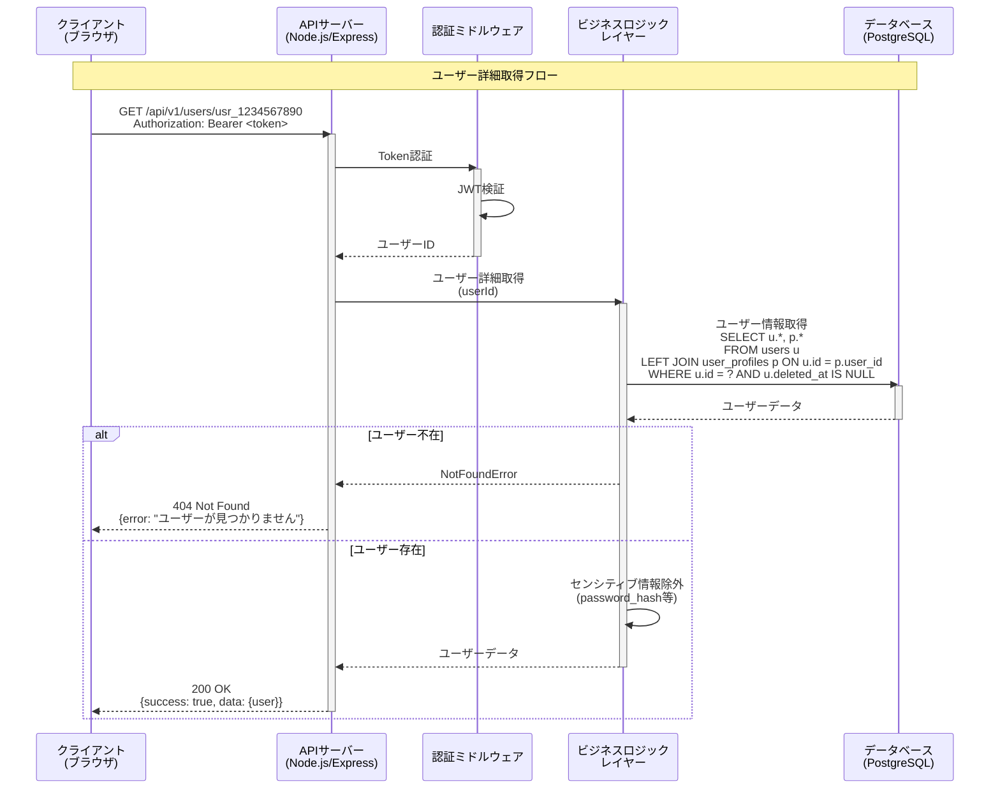
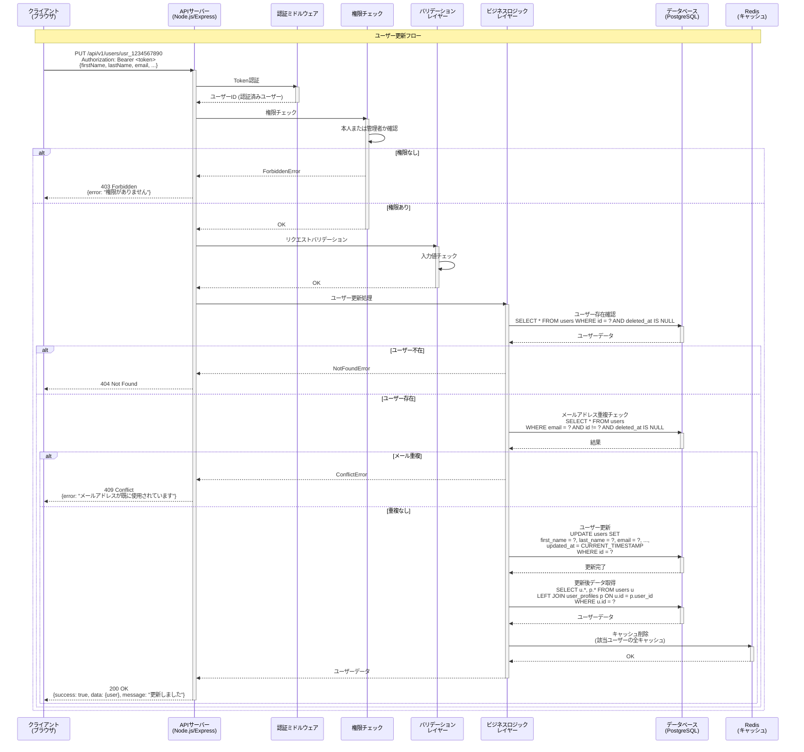
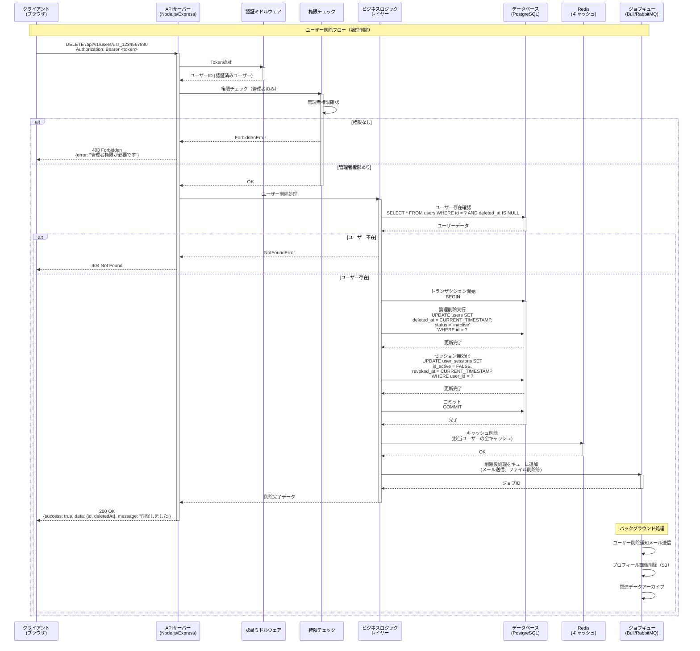
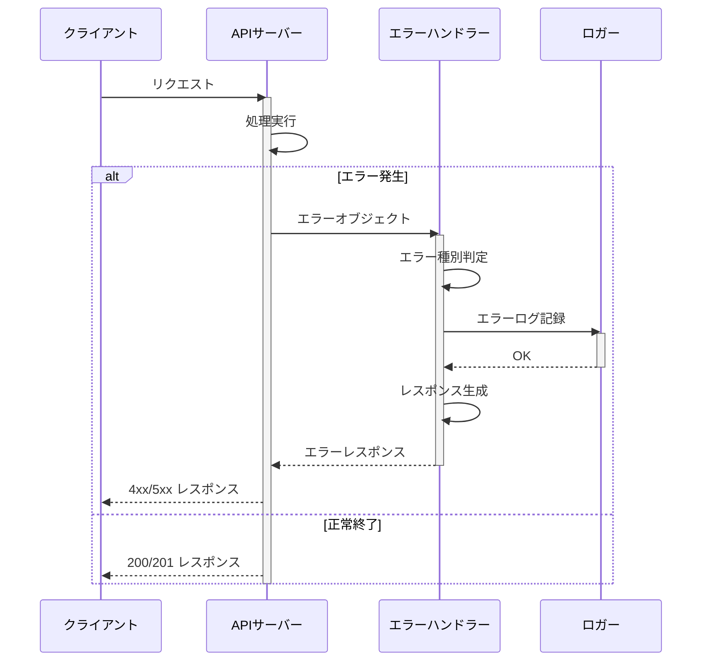

# シーケンス図（CRUD操作）

## プロジェクト: ユーザー管理システム
**作成日**: 2025-11-15
**バージョン**: 1.0

---

## 目次
1. [CREATE（ユーザー作成）](#1-createユーザー作成)
2. [READ（ユーザー一覧取得）](#2-readユーザー一覧取得)
3. [READ（ユーザー詳細取得）](#3-readユーザー詳細取得)
4. [UPDATE（ユーザー更新）](#4-updateユーザー更新)
5. [DELETE（ユーザー削除）](#5-deleteユーザー削除)

---

## 1. CREATE（ユーザー作成）

### シーケンス図



### 処理フロー説明

1. **リクエスト受信**: クライアントから新規ユーザー作成リクエスト
2. **バリデーション**: 入力値の妥当性チェック
3. **重複チェック**: メールアドレスの重複確認
4. **パスワードハッシュ化**: bcryptでパスワードをハッシュ化
5. **ID生成**: ユーザーIDとプロフィールIDを生成
6. **トランザクション処理**:
   - usersテーブルにINSERT
   - user_profilesテーブルにINSERT
7. **デフォルト画像**: 必要に応じてデフォルトプロフィール画像を設定
8. **レスポンス**: 作成されたユーザー情報を返却

---

## 2. READ（ユーザー一覧取得）

### シーケンス図



### 処理フロー説明

1. **認証**: JWTトークンの検証
2. **パラメータ検証**: ページ番号、件数、検索条件のバリデーション
3. **キャッシュ確認**: Redisでキャッシュの有無を確認
4. **データ取得**: ユーザー一覧とプロフィール画像をJOIN取得
5. **総件数取得**: ページネーション用の総件数を取得
6. **ページネーション計算**: 総ページ数、次ページ有無等を計算
7. **キャッシュ保存**: 結果をRedisに保存（60秒間）
8. **レスポンス**: ユーザー一覧とページネーション情報を返却

---

## 3. READ（ユーザー詳細取得）

### シーケンス図



### 処理フロー説明

1. **認証**: JWTトークンの検証
2. **データ取得**: usersとuser_profilesをJOINして取得
3. **存在チェック**: ユーザーの存在確認
4. **センシティブ情報除外**: パスワードハッシュ等を除外
5. **レスポンス**: ユーザー詳細情報を返却

---

## 4. UPDATE（ユーザー更新）

### シーケンス図



### 処理フロー説明

1. **認証**: JWTトークンの検証
2. **権限チェック**: 本人または管理者のみ更新可能
3. **バリデーション**: 入力値の妥当性チェック
4. **存在確認**: 更新対象ユーザーの存在確認
5. **重複チェック**: 変更後のメールアドレスの重複確認
6. **更新実行**: usersテーブルをUPDATE
7. **キャッシュ削除**: 該当ユーザーのキャッシュを削除
8. **レスポンス**: 更新後のユーザー情報を返却

---

## 5. DELETE（ユーザー削除）

### シーケンス図



### 処理フロー説明

1. **認証**: JWTトークンの検証
2. **権限チェック**: 管理者権限の確認
3. **存在確認**: 削除対象ユーザーの存在確認
4. **トランザクション処理**:
   - usersテーブルのdeleted_atを更新（論理削除）
   - user_sessionsの全セッションを無効化
5. **キャッシュ削除**: 該当ユーザーのキャッシュを削除
6. **バックグラウンド処理**: 削除後処理をジョブキューに追加
   - 削除通知メール送信
   - プロフィール画像削除
   - 関連データのアーカイブ
7. **レスポンス**: 削除完了情報を返却

---

## エラーハンドリングパターン

### 共通エラーレスポンス

```json
{
  "success": false,
  "error": {
    "code": "ERROR_CODE",
    "message": "エラーメッセージ",
    "details": [
      {
        "field": "email",
        "message": "メールアドレスの形式が正しくありません"
      }
    ],
    "requestId": "req_xyz789"
  }
}
```

### エラーハンドリングフロー



---

## 変更履歴

| バージョン | 日付 | 変更者 | 変更内容 |
|------------|------|--------|----------|
| 1.0 | 2025-11-15 | 設計チーム | 初版作成 |
