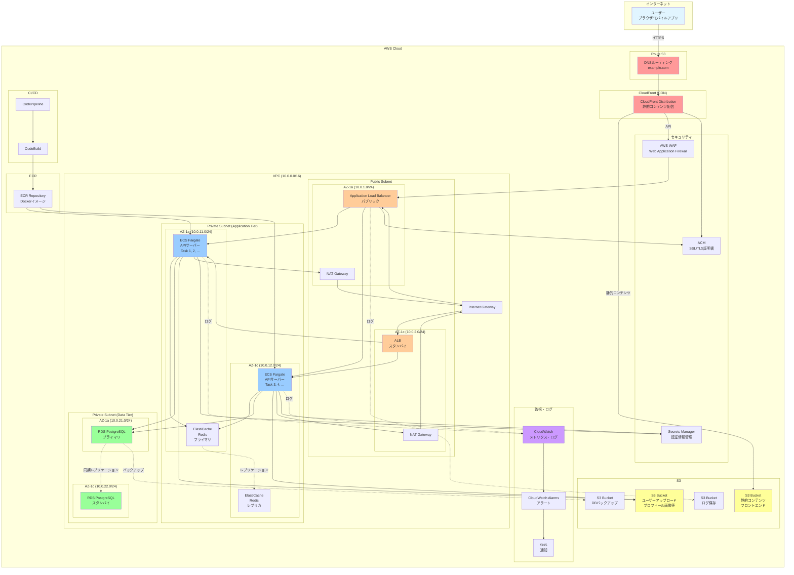

# AWS構成図

## プロジェクト: ユーザー管理システム
**作成日**: 2025-11-15
**バージョン**: 1.0

---

## 目次
1. [システム概要](#システム概要)
2. [AWS構成図](#aws構成図)
3. [各AWSサービスの役割](#各awsサービスの役割)
4. [ネットワーク構成](#ネットワーク構成)
5. [セキュリティ設計](#セキュリティ設計)
6. [可用性・冗長性設計](#可用性冗長性設計)
7. [監視・ログ設計](#監視ログ設計)

---

## システム概要

### アーキテクチャパターン
- **3層アーキテクチャ**: プレゼンテーション層、アプリケーション層、データ層
- **コンテナベース**: ECS（Elastic Container Service）でアプリケーションを稼働
- **マルチAZ構成**: 高可用性のため複数のAvailability Zoneを使用
- **サーバーレス要素**: S3での静的コンテンツ配信

---

## AWS構成図

### 全体構成図（Mermaid）



---

## 各AWSサービスの役割

### 1. Route 53（DNSサービス）

#### 役割
- ドメイン名の管理（example.com）
- DNSルーティング
- ヘルスチェック

#### 設定内容
```
example.com        A     CloudFront Distribution
api.example.com    A     ALB（Application Load Balancer）
```

---

### 2. CloudFront（CDN）

#### 役割
- 静的コンテンツ（HTML/CSS/JS/画像）のキャッシュ配信
- グローバルエッジロケーションで低レイテンシ実現
- DDoS攻撃からの保護

#### オリジン設定
- **S3 Bucket**: 静的コンテンツ（フロントエンドアプリ）
- **ALB**: API通信のプロキシ

#### キャッシュ設定
| コンテンツ種別 | TTL | 備考 |
|-------------|-----|------|
| HTML | 5分 | 頻繁に更新される可能性 |
| CSS/JS | 1日 | バージョン管理でキャッシュバスト |
| 画像 | 7日 | ほとんど変更されない |
| API | キャッシュなし | 動的コンテンツ |

---

### 3. AWS WAF（Web Application Firewall）

#### 役割
- SQLインジェクション防止
- XSS攻撃防止
- レート制限（DDoS対策）
- 地域ブロック（必要に応じて）

#### ルール設定
```
1. AWSマネージドルール（Core Rule Set）
2. IP制限ルール
3. レート制限ルール: 1000リクエスト/5分/IP
4. SQLインジェクション検出ルール
5. XSS検出ルール
```

---

### 4. Application Load Balancer（ALB）

#### 役割
- HTTP/HTTPSトラフィックの負荷分散
- パスベースルーティング
- ヘルスチェック
- SSL/TLS終端

#### リスナー設定
```
- リスナー1: HTTP (80) → HTTPS (443)へリダイレクト
- リスナー2: HTTPS (443) → ターゲットグループ（ECS）へ転送
```

#### ターゲットグループ
- **タイプ**: IP
- **プロトコル**: HTTP
- **ポート**: 3000（Node.jsアプリ）
- **ヘルスチェックパス**: /health
- **ヘルスチェック間隔**: 30秒

---

### 5. ECS Fargate（コンテナ実行環境）

#### 役割
- APIサーバー（Node.js/Express）の実行
- サーバーレスコンテナ実行
- 自動スケーリング

#### クラスター設定
```yaml
Cluster: user-management-api-cluster
Service: api-service
  Task Definition: api-task:latest
  Desired Count: 4
  Min Tasks: 2
  Max Tasks: 10
```

#### タスク定義
```json
{
  "family": "api-task",
  "networkMode": "awsvpc",
  "requiresCompatibilities": ["FARGATE"],
  "cpu": "512",
  "memory": "1024",
  "containerDefinitions": [
    {
      "name": "api-container",
      "image": "123456789.dkr.ecr.ap-northeast-1.amazonaws.com/user-api:latest",
      "portMappings": [
        {
          "containerPort": 3000,
          "protocol": "tcp"
        }
      ],
      "environment": [
        {"name": "NODE_ENV", "value": "production"},
        {"name": "PORT", "value": "3000"}
      ],
      "secrets": [
        {"name": "DB_PASSWORD", "valueFrom": "arn:aws:secretsmanager:..."},
        {"name": "JWT_SECRET", "valueFrom": "arn:aws:secretsmanager:..."}
      ],
      "logConfiguration": {
        "logDriver": "awslogs",
        "options": {
          "awslogs-group": "/ecs/user-api",
          "awslogs-region": "ap-northeast-1",
          "awslogs-stream-prefix": "api"
        }
      }
    }
  ]
}
```

#### Auto Scaling設定
```
- ターゲット追跡スケーリング
  - CPU使用率 70%を維持
  - メモリ使用率 80%を維持
- スケジュールスケーリング
  - 平日9:00: 最小4タスク
  - 平日22:00: 最小2タスク
```

---

### 6. ElastiCache for Redis（キャッシュ）

#### 役割
- セッションストア
- APIレスポンスキャッシュ
- レート制限カウンター

#### クラスター設定
```
- ノードタイプ: cache.t3.medium
- エンジンバージョン: Redis 7.0
- レプリケーショングループ: 1プライマリ + 1レプリカ
- マルチAZ: 有効
- 自動フェイルオーバー: 有効
```

#### 用途別TTL設定
| 用途 | TTL | キー例 |
|------|-----|-------|
| ユーザーセッション | 1時間 | session:{sessionId} |
| ユーザー一覧 | 60秒 | users:page:{page}:limit:{limit} |
| ユーザー詳細 | 5分 | user:{userId} |
| レート制限 | 5分 | ratelimit:{ip}:{endpoint} |

---

### 7. RDS for PostgreSQL（データベース）

#### 役割
- ユーザーデータの永続化
- トランザクション処理
- リレーショナルデータ管理

#### インスタンス設定
```
- インスタンスクラス: db.t3.medium
- エンジン: PostgreSQL 15.3
- マルチAZ: 有効（同期レプリケーション）
- ストレージ: 100GB SSD (gp3)
- 自動バックアップ: 有効（保持期間7日）
- バックアップウィンドウ: 03:00-04:00 JST
- メンテナンスウィンドウ: 日曜 04:00-05:00 JST
```

#### 暗号化
- **保存時暗号化**: AWS KMS使用
- **転送時暗号化**: SSL/TLS必須

#### パラメータグループ設定
```
max_connections = 200
shared_buffers = 256MB
effective_cache_size = 1GB
maintenance_work_mem = 64MB
work_mem = 4MB
```

---

### 8. S3（オブジェクトストレージ）

#### S3バケット一覧

##### 8-1. 静的コンテンツバケット
```
バケット名: user-app-frontend-prod
用途: フロントエンドアプリ（React/Vue等）
公開設定: CloudFront経由のみアクセス可
バージョニング: 有効
ライフサイクル: なし
```

##### 8-2. ユーザーアップロードバケット
```
バケット名: user-app-uploads-prod
用途: プロフィール画像等のユーザーアップロード
公開設定: 署名付きURL経由のみ
バージョニング: 有効
ライフサイクル:
  - 30日後に標準IAへ移行
  - 90日後にGlacierへ移行
CORS設定: 有効
```

##### 8-3. ログバケット
```
バケット名: user-app-logs-prod
用途: ALB/CloudFrontアクセスログ
公開設定: 非公開
ライフサイクル:
  - 90日後に削除
```

##### 8-4. バックアップバケット
```
バケット名: user-app-backups-prod
用途: RDSバックアップ
公開設定: 非公開
バージョニング: 有効
ライフサイクル:
  - 30日後にGlacierへ移行
  - 365日後に削除
```

---

### 9. Secrets Manager（シークレット管理）

#### 役割
- DBパスワード管理
- JWT秘密鍵管理
- API キー管理

#### 管理対象シークレット
```
1. rds/user-db/master-password
2. app/jwt-secret
3. app/encryption-key
4. external-api/key
```

#### 自動ローテーション
- RDSパスワード: 90日ごと
- JWT秘密鍵: 手動ローテーション（必要時）

---

### 10. CloudWatch（監視・ログ）

#### メトリクス監視

##### ECS
- CPU使用率
- メモリ使用率
- タスク数
- ヘルシータスク数

##### ALB
- ターゲット応答時間
- リクエスト数
- 4xx/5xxエラー率
- アクティブ接続数

##### RDS
- CPU使用率
- 空きメモリ
- ディスクI/O
- DB接続数
- レプリケーション遅延

##### ElastiCache
- CPU使用率
- メモリ使用率
- キャッシュヒット率
- エビクション数

#### ログ収集
```
- /ecs/user-api: アプリケーションログ
- /aws/rds/postgresql: データベースログ
- /aws/elasticache/redis: Redisログ
```

#### アラーム設定
```yaml
Alarms:
  - Name: ECS-CPU-High
    Metric: CPUUtilization > 80%
    Period: 5分
    Action: SNS通知 + Auto Scaling

  - Name: RDS-Connection-High
    Metric: DatabaseConnections > 180
    Period: 5分
    Action: SNS通知

  - Name: ALB-5xx-Error-High
    Metric: HTTPCode_Target_5XX_Count > 10
    Period: 1分
    Action: SNS通知

  - Name: Redis-Memory-High
    Metric: DatabaseMemoryUsagePercentage > 90%
    Period: 5分
    Action: SNS通知
```

---

### 11. ECR（コンテナレジストリ）

#### 役割
- Dockerイメージの保存
- イメージスキャン
- ライフサイクル管理

#### リポジトリ設定
```
リポジトリ名: user-management-api
イメージスキャン: プッシュ時自動スキャン
ライフサイクルポリシー:
  - 最新10イメージを保持
  - 30日以上前のイメージを削除
```

---

## ネットワーク構成

### VPC設計

```
VPC CIDR: 10.0.0.0/16

Public Subnet:
  - 10.0.1.0/24 (AZ-1a) - ALB, NAT Gateway
  - 10.0.2.0/24 (AZ-1c) - ALB, NAT Gateway

Private Subnet (Application):
  - 10.0.11.0/24 (AZ-1a) - ECS, Redis
  - 10.0.12.0/24 (AZ-1c) - ECS, Redis

Private Subnet (Data):
  - 10.0.21.0/24 (AZ-1a) - RDS Primary
  - 10.0.22.0/24 (AZ-1c) - RDS Standby
```

### ルートテーブル

#### Public Subnet Route Table
```
10.0.0.0/16    → local
0.0.0.0/0      → Internet Gateway
```

#### Private Subnet Route Table
```
10.0.0.0/16    → local
0.0.0.0/0      → NAT Gateway
```

---

## セキュリティ設計

### セキュリティグループ

#### ALB Security Group
```
Inbound:
  - Port 443 (HTTPS): 0.0.0.0/0
  - Port 80 (HTTP): 0.0.0.0/0

Outbound:
  - Port 3000: ECS Security Group
```

#### ECS Security Group
```
Inbound:
  - Port 3000: ALB Security Group

Outbound:
  - Port 5432: RDS Security Group
  - Port 6379: Redis Security Group
  - Port 443: 0.0.0.0/0 (外部API, S3等)
```

#### RDS Security Group
```
Inbound:
  - Port 5432: ECS Security Group

Outbound:
  - なし
```

#### Redis Security Group
```
Inbound:
  - Port 6379: ECS Security Group

Outbound:
  - なし
```

---

## 可用性・冗長性設計

### マルチAZ構成
- **ALB**: 2つのAZに配置
- **ECS**: 2つのAZに最低1タスクずつ
- **RDS**: マルチAZ（同期レプリケーション）
- **Redis**: レプリケーショングループ（自動フェイルオーバー）

### 障害時の動作
```
1. AZ-1a障害時:
   - ALBが自動的にAZ-1cのターゲットへルーティング
   - ECSタスクがAZ-1cで追加起動
   - RDSが自動フェイルオーバー（60秒以内）

2. ECSタスク障害時:
   - ヘルスチェック失敗でタスク再起動
   - 新しいタスクが自動起動

3. RDSプライマリ障害時:
   - マルチAZ自動フェイルオーバー
   - スタンバイがプライマリに昇格
```

---

## 監視・ログ設計

### ログ収集フロー
```
ALB → S3 (アクセスログ)
ECS → CloudWatch Logs → S3 (長期保存)
RDS → CloudWatch Logs
```

### アラート通知フロー
```
CloudWatch Alarms → SNS → Email/Slack/PagerDuty
```

---

## コスト最適化

### 推定月額コスト（東京リージョン）

| サービス | 構成 | 月額概算 |
|---------|------|---------|
| ECS Fargate | 4タスク × 0.5vCPU × 1GB | $50 |
| RDS PostgreSQL | db.t3.medium × 2 (Multi-AZ) | $150 |
| ElastiCache Redis | cache.t3.medium × 2 | $100 |
| ALB | 1個 | $25 |
| S3 | 100GB + リクエスト | $10 |
| CloudFront | 100GB転送 | $15 |
| Route 53 | ホストゾーン1個 | $0.5 |
| CloudWatch | ログ10GB | $5 |
| **合計** | | **約$355/月** |

---

## 変更履歴

| バージョン | 日付 | 変更者 | 変更内容 |
|------------|------|--------|----------|
| 1.0 | 2025-11-15 | 設計チーム | 初版作成 |
